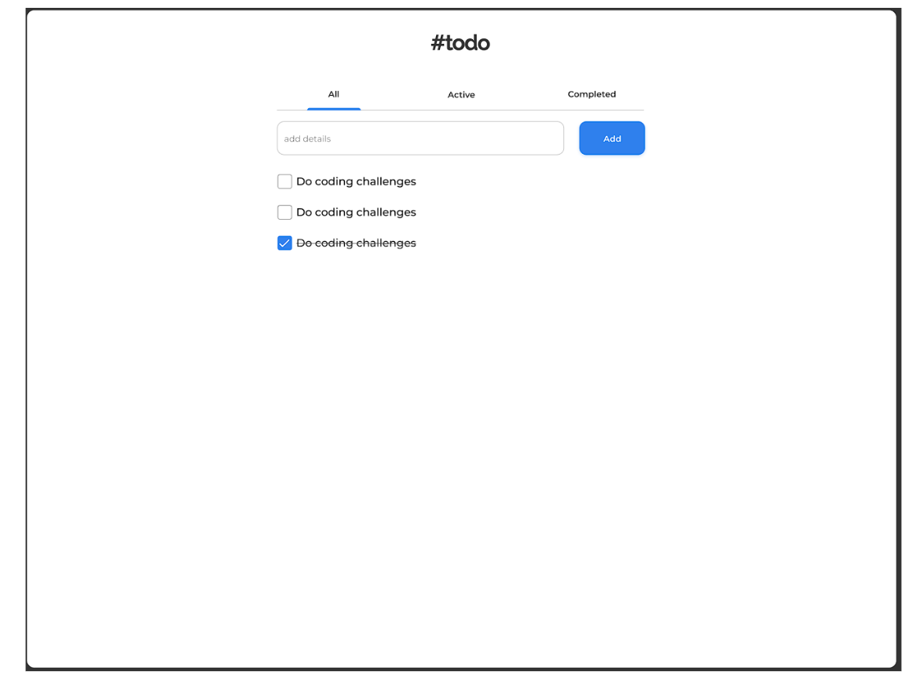
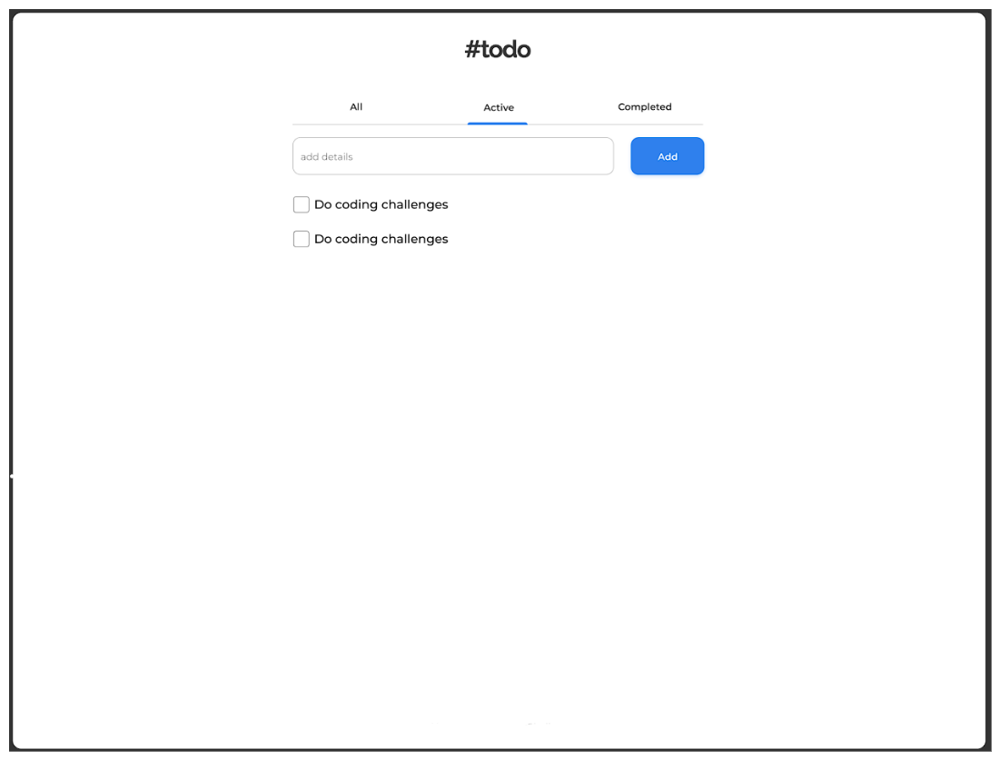
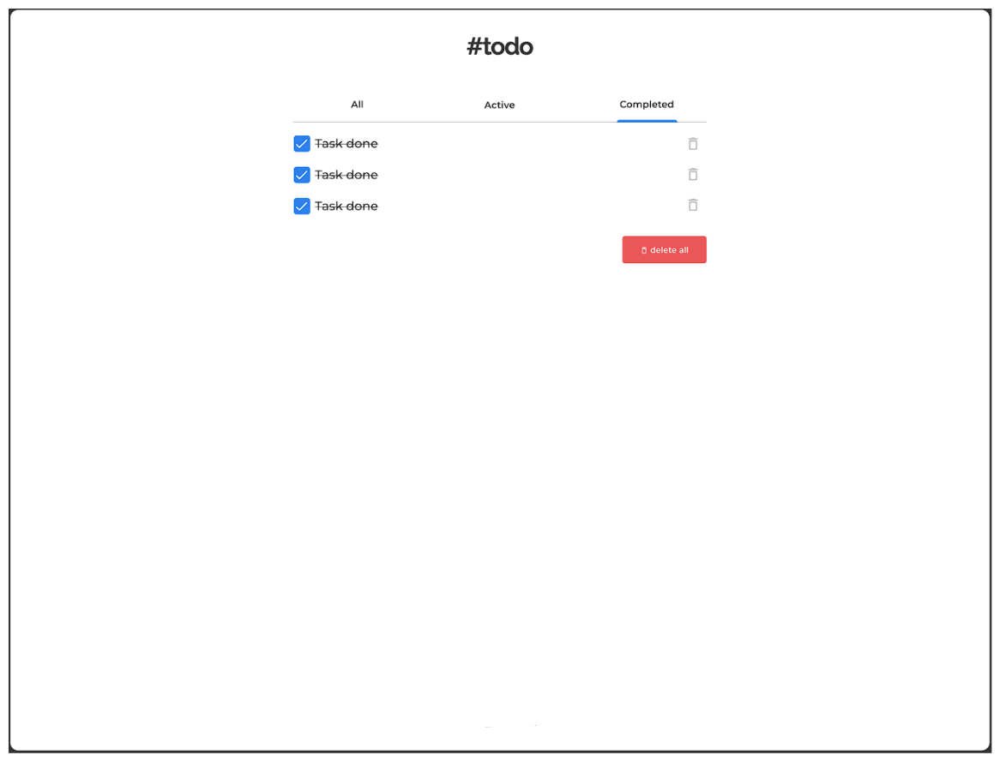
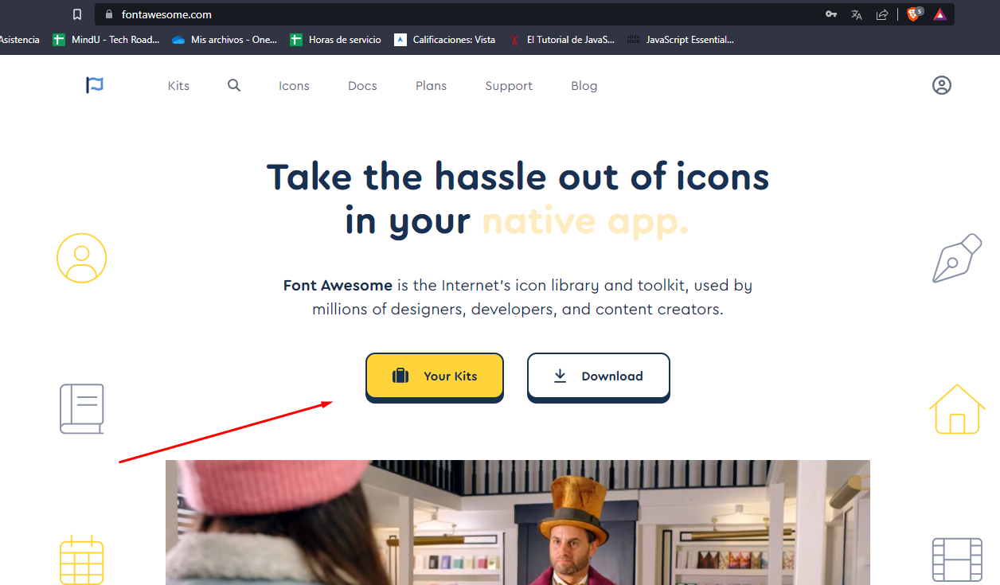
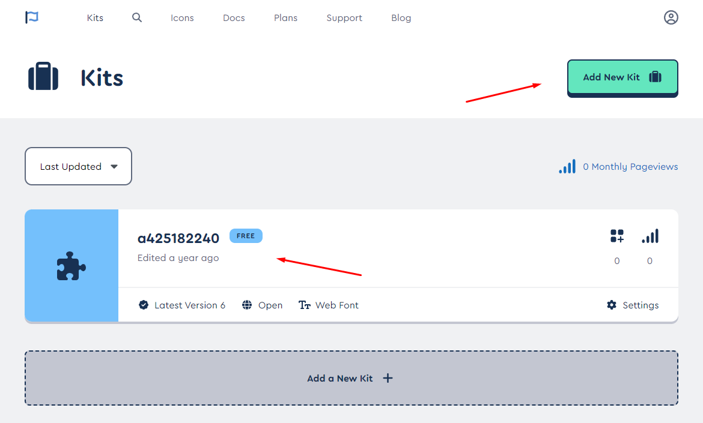
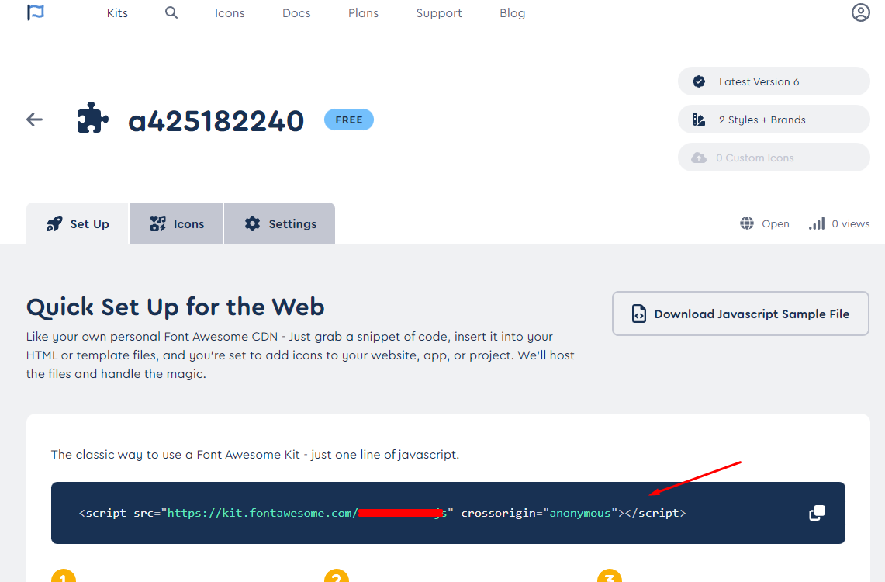

# Instrucciones

Bienvenido al proyecto final del nivel 1. En este proyecto estaremos aplicando los conocimientos adquiridos a lo largo del nivel. Sigue las instrucciones de este archivo para completar el proyecto y ten en cuenta que estas mismas instrucciones se tomarán en cuenta para la evaluación del proyecto.

## Instrucciones generales

La empresa **Funval** desea implementar un nuevo sistema que ayude a los trabajarores a organizar sus tareas pendientes. El diseño de la aplicación web ya está terminado y ahora necesita que lleves a codigo este proyecto. Por suerte, ya tienes una base de código que puedes utilizar para comenzar a trabajar. Según las instrucciones que el cliente nos ha dado, te daré las instrucciones para completar el proyecto.

El Diseño es el siguiente: 





## Instrucciones del proyecto

### Layout | Diseño

El diseño responsive para esta página web es opcional. Para lograr esto, el cliente y tu han acordado que de manera opcional se podrá trabajar con la librería de Bootstrap 5. Si no es el caso, puedes utilizar únicamente CSS.


### Fuentes

Las fuentes para este proyecto las hemos traido de [Google Fonts - Poppins](https://fonts.google.com/specimen/Poppins), ten en cuenta que debes importar las fuentes a usar en el proyecto como ya lo hemos aprendido en clase. Recuerda que para usarlas desde CSS, puedes utilizar la siguiente sintaxis:

```css
font-family: 'Poppins', sans-serif; /* Fuente principal */
```

### Iconos

Para los iconos, utilizaremos la librería de iconos: [Font-Awesome](https://fontawesome.com/). Para usarlos puede seguir el enlace anterior, crearte una cuenta si no tienes una ya, y configurar el kit. 

Al crear tu cuenta, puedes ir a la seccion de kits que te aparece en la página principal:



Luego, en caso no tengas un kit creado, puedes dar click en el botón de "Create new kit":



Luego de crear tu kit, copia el código que te aparece en la sección de "Setup":



Este código lo pegas en tu `<head>` del documento `index.html`.

Para usar los iconos, solo ve a buscarlos y copia el codigo html, recuerda que al ser una cuenta gratuita, solo debes copiar los iconos "Free" (gratis), ya que si copias los iconos de paga, no te aparecerán en tu proyecto.
Por ejemplo:

```html
<i class="fa-solid fa-trash-xmark"></i>
```


## Código base

Nosotros ya hemos creado algunos nombres de funciones que te pueden servir, sin embargo, no te limites a estas funciones, ya que son una guia de algunas partes que debes tener dentro de tu programa. Este contiene un código base, el cual eres libre de modificar a tu gusto.

Para descargarlo, debes dirigirte al botón verde de arriba a la derecha del repositorio que dice `<> Code` y dar click. Allí te aparecerá una opción que diga `Download ZIP`. Eso te descargará los archivos del repositorio. Luego descomprime el archivo descargado.

## Consideraciones para la calificación

A continuación te diremos cuales son los puntos que se tomarán en cuenta para la calificacion del proyecto:

- El diseño debe ser lo más fiel posible al proporcionado en las imagenes.
- Los colores, fuentes, tamaños de letra, etc. deben ser lo mas cercanos a los que se ven en las imagenes.
- En la seccion **All** deben aparecer todas las tareas existentes, tanto las activas como las completas.
- En la seccion **Active** deben aparecer solo las tareas activas.
- En la seccion **Completed** deben aparecer solo las tareas completas. Tambien debe haber un boton para borrar las tareas completas, se deben poder borrar una por una o todas con un solo boton.
- En todas las vistas se permite marcar o descarmar una tarea como completada.
- Las tareas completadas deben tener un estilo diferente a las tareas activas, deben estar tachadas como se muestra en las imagenes.
- El proyecto debe ser estructurado de forma que sea fácil de entender y mantener.
- El proyecto debe ser desplegado en Netlify drop.

#### Consideraciones OPCIONALES que también podrían sumar puntos:
- El diseño debe ser 100% responsive.
- El proyecto debe ser desarrollado con Bootstrap 5. Para los estilos **que no se puedan** lograr con Bootstrap, puedes utilizar CSS puro.
- Añadir una funcionalidad extra a las tareas, por ejemplo, generar persistencia de datos aprovechando el localStorage, permitir la edicion de una tarea actual, añadir subtareas, etc.
